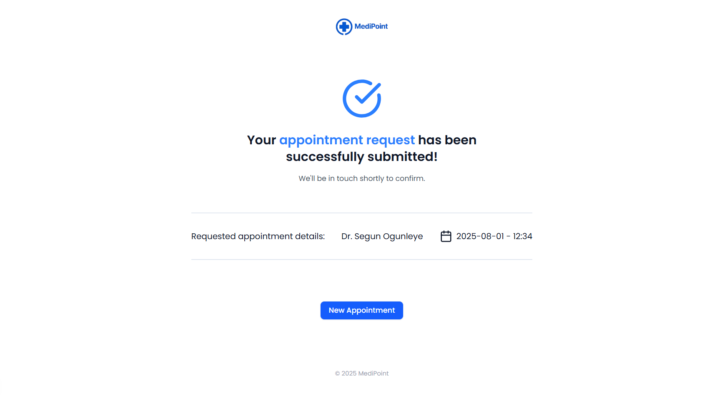

<<<<<<< HEAD
# MediPoint

MediPoint is a modern healthcare appointment platform designed to streamline the process of booking and managing medical appointments. The application features a clean, user-friendly interface and leverages a robust technology stack to deliver a seamless experience for both patients and healthcare providers.

## Features

- **Appointment Booking:** Patients can easily request and manage appointments with their preferred doctors and departments.
- **Responsive UI:** Clean, accessible, and responsive design for all devices.
- **Confirmation & Feedback:** Users receive instant feedback and confirmation upon submitting appointment requests.
- **User Authentication:** Secure login and registration flows.
- **Form Validation:** Robust client-side validation for all forms.

## Technologies Used

- **Next.js** – React framework for server-side rendering and routing.
- **React** – Component-based UI development.
- **TypeScript** – Type safety for scalable and maintainable code.
- **Prisma** – Modern ORM for database access.
- **Zod** – Schema validation for forms and API routes.
- **React Hook Form** – Performant and flexible form management.
- **Lucide React** – Icon library for consistent, modern icons.
- **Tailwind CSS** – Utility-first CSS framework for rapid UI development.
- **NextAuth.js** – Authentication for Next.js applications.

## UI/UX Design

- **Minimalist & Clean:** The interface uses whitespace, clear typography, and a consistent color palette for a professional look.
- **Accessible:** All components are designed with accessibility in mind.
- **Feedback-Oriented:** Users receive clear feedback on actions, such as appointment submissions and errors.

## Getting Started

1. **Clone the repository:**
   ```sh
   git clone https://github.com/noeljr2306/medipoint-system.git
   cd medipoint
   ```

2. **Install dependencies:**
   ```sh
   npm install
   ```

3. **Set up environment variables:**
   - Copy  `.env` and fill in the required values.

4. **Run the development server:**
   ```sh
   npm run dev
   ```

5. **Open [http://localhost:3000](http://localhost:3000) in your browser.**

## Folder Structure

- `app/` – Next.js app directory (pages, layouts, API routes)
- `components/` – Reusable UI components and forms
- `lib/` – Utility functions and helpers
- `prisma/` – Prisma schema and migrations
- `public/` – Static assets (images, icons)
- `schema/` – Zod schemas for validation
- `types/` – TypeScript type definitions

## Screenshots


*Clean, modern confirmation page after booking an appointment.*
=======
# Medipoint - Health Appointment System

**Status:** 🚧 Project Under Development 🚧

This is a health appointment system designed to streamline booking and managing medical appointments.

---

## About

Medipoint aims to provide an easy-to-use platform for patients, doctors, and staff to schedule and manage health appointments efficiently. The project is currently a work in progress, and many features are still being built and tested.

---

## Current Status

- Core features such as user registration and login are being developed.
- Appointment booking, notifications, and other functionalities are planned.
- UI/UX design is ongoing to ensure a smooth user experience.

---

## Getting Started

Please note that this project is not yet ready for production use. Feel free to follow the repository for updates.

---

## Contact

For questions or suggestions, please reach out to the project maintainer.

---

Thank you for your interest and patience!

>>>>>>> 10122d5a9d726c5e888f5bb3e13aaae6fc0ae1a0
